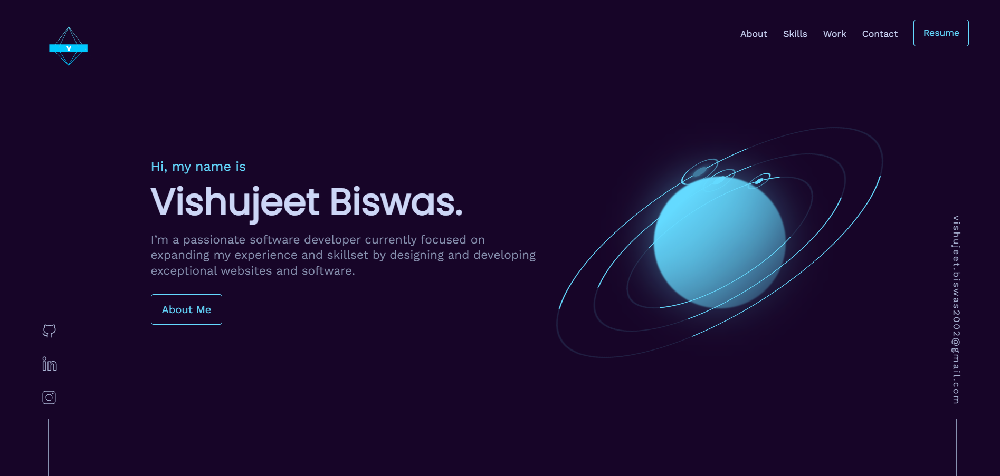

# Portfolio Website



Welcome to my portfolio website repository! This repository contains the source code and assets for my personal portfolio website.

## Introduction

This portfolio website is designed to showcase my skills, projects, and experiences to potential clients, employers, and collaborators. It provides a clean and professional interface for users to explore my work and learn more about me.

The website is fully responsive, ensuring that it looks great and functions well on various devices, including desktops, tablets, and mobile devices.

## Features

- **Home**: The landing page provides a brief introduction and overview of my skills and expertise.
- **About**: This section contains detailed information about my background, education, work experience, and interests.
- **Projects**: A showcase of my past projects, including descriptions, technologies used, and links to live demos or repositories.
- **Skills**: An overview of my technical skills, programming languages, frameworks, and tools.
- **Resume**: Users can view and download my resume in PDF format.
- **Contact**: A contact form for users to reach out to me directly. It includes fields for name, email, and message.

## Technologies Used

The following technologies and libraries were used to develop this portfolio website:

- HTML5
- CSS3
- JavaScript
- Bootstrap
- jQuery
- Font Awesome

## Setup and Usage

To set up the portfolio website locally and customize it for your own use, follow these steps:

1. Clone the repository:

   ```bash
   git clone https://github.com/your-username/portfolio-website.git
   ```

2. Navigate to the project directory:

   ```bash
   cd portfolio-website
   ```

3. Customize the content:

   - Open the project in a text editor of your choice.
   - Modify the HTML files in the `index.html`, `about.html`, `projects.html`, and `contact.html` directories to include your own information.
   - Replace the images in the `assets/images` directory with your own images.
   - Customize the CSS in the `assets/css` directory to match your preferred style.

4. Launch the website:

   - You can use a local development server or simply open the HTML files in your preferred web browser.

5. Deploy the website:

   - To make the website accessible to others, you can host it on Firebase Hosting.
   - Set up a Firebase project and install the Firebase CLI.
   - Use the Firebase CLI to deploy the website to Firebase Hosting.

```bash
firebase login  # Log in to your Firebase account
firebase init   # Initialize your Firebase project (select Hosting)
firebase deploy # Deploy the website to Firebase Hosting
```

6. Your portfolio website is now hosted on Firebase. Access it using the URL(https://vishujeet-biswas-portfol-180e2.web.app/).

## License

This project is licensed under the [MIT License](LICENSE).

## Contact

If you have any questions, suggestions, or would like to collaborate, please feel free to reach out to me. You can contact me at:

- LinkedIn: [Vishujeet Biswas](https://www.linkedin.com/in/vishujeet-biswas/)
- Twitter: [@thevishhuwayy](https://twitter.com/thevishhuwayy)

Thank you for visiting my portfolio website repository! I look forward to connecting with you.
